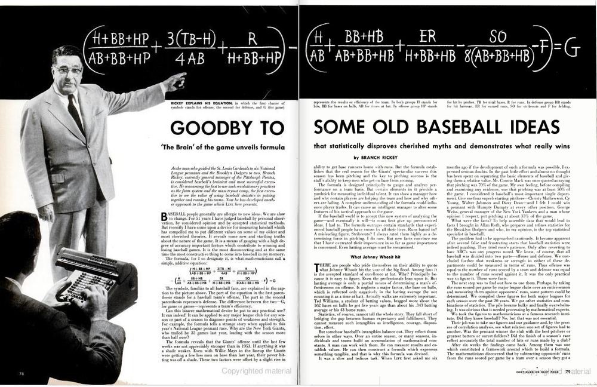
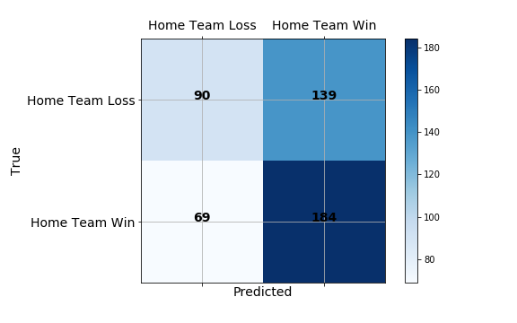

# Major League Baseball - Statistical Analysis and Predictions 

## Motivation and Process Overview 

Baseball is many things. It's an immensely popular professional sport, a [convenient metaphor](https://deadspin.com/baseball-is-the-horniest-sport-1809943124) for uncomfortable conversations, and perhaps above all else, it's quintessentially American. For some, it conjures nostalgic images of a shared history with its country of origin or childhood daydreams of glory.  It can remind us of who we used to be. But for me, baseball represents a vision of what America could be. A world in which we take [care of our own](https://benefitsbclp.com/major-league-baseball-pension-and-healthcare-benefits/), where respect and hard work are acknowledged and rewarded, diversity is celebrated, and [cheaters never prosper](https://www.usatoday.com/story/sports/mlb/astros/2020/01/13/astros-stealing-signs-penalties-jeff-luhnow-aj-hinch-suspended-year/4456644002/).

It's also a hotbed for [statistical analysis](https://en.wikipedia.org/wiki/Baseball_statistics). *The Baseball Encyclopedia*, published in 1969, was one of the earliest examples of coding and computer software in book publishing. It was the first book to use computer typesetting besides besides the phone book. In those days, every player's data were individually compiled on sheets of paper, coded into punch cards, and sorted by an IBM 360. The results were totaled, combined, and compared with official records. Inconsistencies were flagged by the computer for further investigation. 

For this project, we'll perform a similar process for our analyses. Instead of using punch cards and magnetic tape, we'll use Python and the [SQLAlchemy ORM framework](https://docs.sqlalchemy.org/en/13/orm/index.html) for storing and accessing data gathered from the MLB API, explore our data with visualizations in Plotly, and perform statistical analysis with Pandas and scikit-learn. 

### MLB Stats API and SQLAlchemy ORM
The MLB stats API returns an exceptional amount of information for every game. The first and most substantial part of this project was parsing the information from a single game's API into a normalized database. The work was worth it because storing this information systematically means that I don't have to return to the API to perform my analysis, and I'll have the information ready for future projects. 

Our database allows us to store and retrieve comprehensive data on games, players, teams, team records, pitches, plays, runners, and the relationships between them. In it's current form, the database stores this information in 17 different tables.

The SQL Alchemy ORM framework facilitates a connection between Python objects and SQL records. The ORM framework can be extremely useful when pulling information from multiple tables. For instance, a record in the Games table corresponds to a unique instance of the Game class based on the SQLAlchemy declaritive base. The Game instance has an attribute, .plays, that returns all plays from that game in chronological order. This gives us an easy shortcut that's quicker than writing repetitive INNER JOIN statements everytime we need to examine a relationship. 

## Statistical Modeling

### Predicting Game Winners

#### Background
Branch Rickey is one of the most influential figures in the history of baseball. He is most famous for signing Jackie Robinson in 1945. 

In 1954, Branch Rickey worked with Princeton mathemeticians to develop a formula that predicts a team's performance for a season. He came up with the formula pictured in the Life Magazine article above. His findings have proved massively influential in the following decades. In particular, he discovered that On-Base Percentage, or the number of times a player gets on base divided by their plate-appearances, was more important than Batting Average. By contrast, Batting Average is the percentage of hits vs qualified at-bats. BA does not take into account instances when players reach first base by earning a walk on four balls. Years later, Billy Bean would famously leverage this stat to take his under-dog Oakland Athletics to the post-season 4 years in a row. This story was made famous in Michal Lewis' book, *Moneyball*.

#### Process 
Rickey's oringal formula is designed to expalin a team's performance throughout a season, but I wanted to see if we could use these feature to predict the winner of a single game. To gather the data, I needed to to collect players' stats for every game of the season leading up to, but not including, each game in question. For the defensive stats, I seperated starters and relievers by filtering pitchers by the porportion of games started vs games played. I didn't include any starters in my model besides the pitcher that started that particular game (typically, starting pitchers rest for 5 days after starting a game). 

I tried 3 different models: logistic regression, a linear support vector machine, and a random forest to predict a home team win for games in the 2019 season. When tuning models, I favored precision over recall because I thought that would be more useful in a real world envirnonment. Also, since the home team generally wins more often, a model that favors recall or the f1 score returns far too many false positives to be realistically useful. 

### Conclusion

In the end, my model did not produce stellar results. Branch Rickey's features have proven to succesfully determine who is the better team over a the course of a season, but Baseball is a unique sport in that the better team often loses. Even the most elite team will lose over 60 games a year. To improve this model in the future, I'll need to consider what features might explain when the better team loses. Factors like pitcher rest or travel distance might be useful. 

